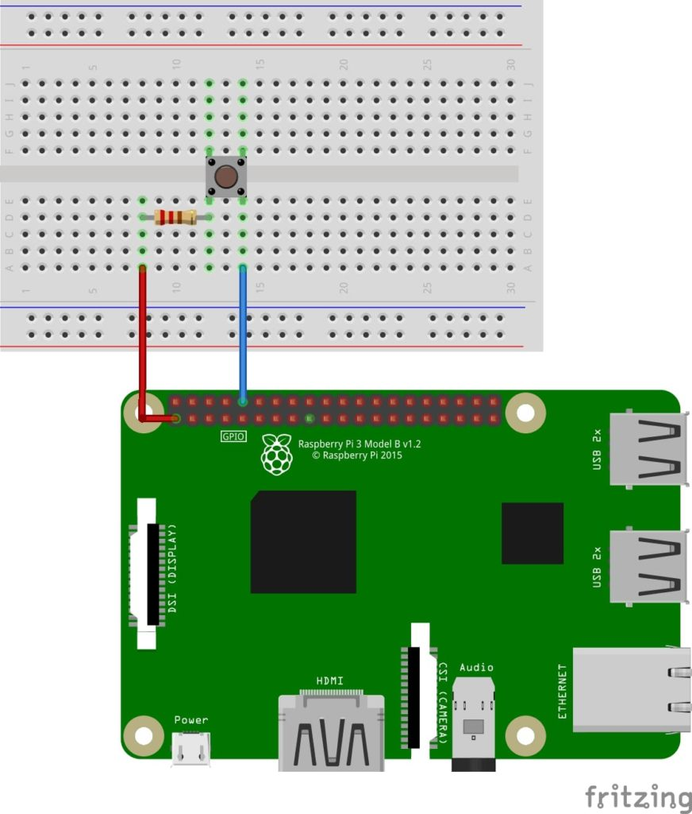

Para rodar o script pushbutton.py :

- Instalar:
    pip3 install python3-xlib

    sudo apt-get install scrot

    sudo apt-get install python3-tk

    sudo apt-get install python3-dev

    pip3 install pyautogui

    sudo apt-get install python-rpi.gpio python3-rpi.gpio

<!-- [ -->
