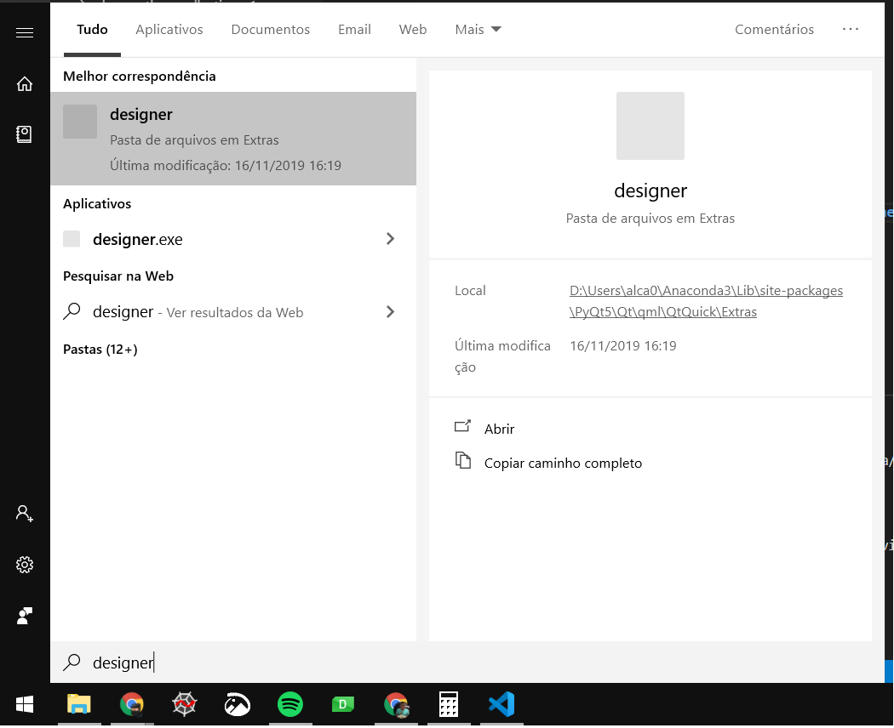
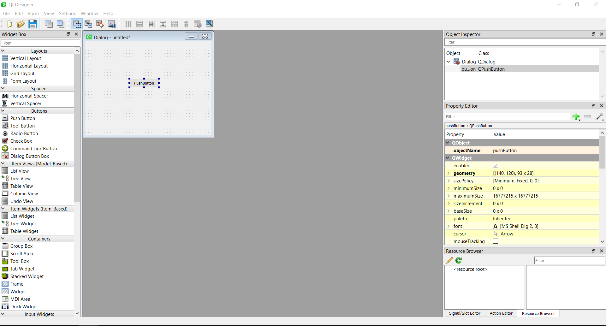

# Instalando PyQt5:

-   pip install PyQt5

# Instalando PyQt5-tools:

-   pip install PyQt5-tools

Se usa o Spyder e der ruim nele:

-   pip install PyQt5==5.10.1

# Feito isso, agora é só clicar em windows e procurar designer

<!-- [ -->

# Agora crie uma janela com um botão:

    Arraste o botão para a janela

<!-- [ -->

    Salve o arquivo .ui

# Abrir o prompt de comando e localizar a pasta de Scripts do seu Python:

Para localizar, abra o python e execute:

    import os
    import sys
    print(os.path.dirname(sys.executable))

No meu caso, uso o anaconda. Então tenho como resultado:

    cd C:\Users\alca0\Anaconda3\Scripts

# Copiar o ui feito salvo pelo qtdesigner e converter para .py

    pyuic5 -x "C:\Users\alca0\Documents\Python Scripts\teste.ui" -o C:\Users\alca0\Documents\Python Scripts\teste.py"

# executar teste.py no vscode e ser feliz

    Use o meu comoo exemplo, pois já adicionei uma função
